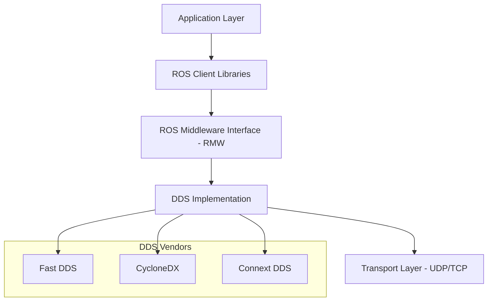

# 5.1 Architecture and Design Principles

## Learning Objectives

By the end of this section, you will:
- Understand the fundamental architecture of ROS 2
- Compare ROS 2 with ROS 1 and appreciate the improvements
- Grasp the design principles that guide ROS 2 development
- Understand the middleware layer and Data Distribution Service (DDS)

## Introduction

Robot Operating System 2 (ROS 2) represents a significant evolution from ROS 1, designed from the ground up to address the limitations of its predecessor while maintaining the benefits that made ROS popular in the robotics community.

## ROS 2 Architecture Overview

### Core Components



The ROS 2 architecture consists of several key layers:

1. **Application Layer**: Your robot applications and nodes
2. **ROS Client Libraries**: Language-specific APIs (rclcpp, rclpy, etc.)
3. **ROS Middleware Interface (RMW)**: Abstraction layer for DDS
4. **DDS Implementation**: The underlying communication middleware
5. **Transport Layer**: Network communication protocols

### Key Design Principles

#### 1. **Real-time Capabilities**

Unlike ROS 1, ROS 2 was designed with real-time systems in mind:

```cpp
// Example: Setting real-time executor priorities
#include <rclcpp/rclcpp.hpp>
#include <rclcpp/executors.hpp>

int main(int argc, char** argv) {
    rclcpp::init(argc, argv);
    
    // Create real-time executor
    rclcpp::executors::SingleThreadedExecutor executor;
    
    // Set real-time scheduling
    struct sched_param param;
    param.sched_priority = 50;
    if (sched_setscheduler(0, SCHED_FIFO, &param) == -1) {
        perror("sched_setscheduler failed");
    }
    
    auto node = std::make_shared<rclcpp::Node>("realtime_node");
    executor.add_node(node);
    executor.spin();
    
    rclcpp::shutdown();
    return 0;
}
```

#### 2. **Security by Design**

ROS 2 includes built-in security features:

- **DDS Security**: Authentication, encryption, and access control
- **SROS2**: Secure ROS 2 implementation
- **Certificate-based authentication**

```bash
# Generate security certificates
ros2 security generate_artifacts -k keystore -p policies/
```

#### 3. **Multi-platform Support**

ROS 2 supports multiple operating systems:
- Linux (Ubuntu, RHEL, etc.)
- Windows 10/11
- macOS
- Real-time operating systems (QNX, VxWorks)

#### 4. **Language Agnostic**

While maintaining strong C++ and Python support, ROS 2 architecture allows for other languages:

```python
# Python node example
import rclpy
from rclpy.node import Node
from std_msgs.msg import String

class MinimalPublisher(Node):
    def __init__(self):
        super().__init__('minimal_publisher')
        self.publisher_ = self.create_publisher(String, 'topic', 10)
        timer_period = 0.5
        self.timer = self.create_timer(timer_period, self.timer_callback)
        self.i = 0

    def timer_callback(self):
        msg = String()
        msg.data = f'Hello World: {self.i}'
        self.publisher_.publish(msg)
        self.get_logger().info(f'Publishing: "{msg.data}"')
        self.i += 1
```

## Data Distribution Service (DDS)

DDS is the foundation of ROS 2 communication, providing:

### Quality of Service (QoS)

```python
from rclpy.qos import QoSProfile, QoSReliabilityPolicy, QoSDurabilityPolicy

# Configure QoS for reliable communication
qos_profile = QoSProfile(
    reliability=QoSReliabilityPolicy.RELIABLE,
    durability=QoSDurabilityPolicy.TRANSIENT_LOCAL,
    depth=10
)

publisher = node.create_publisher(String, 'reliable_topic', qos_profile)
```

### Discovery Mechanism

```bash
# View node discovery information
ros2 node list
ros2 topic list
ros2 service list
```

## Comparison with ROS 1

| Feature | ROS 1 | ROS 2 |
|---------|--------|--------|
| **Master Node** | Required rosmaster | Decentralized discovery |
| **Communication** | Custom TCP/UDP | DDS standard |
| **Real-time** | Limited support | Built-in real-time |
| **Security** | None | DDS Security + SROS2 |
| **Multi-platform** | Linux only | Linux, Windows, macOS |
| **Language Support** | C++, Python | C++, Python, + others |
| **Quality of Service** | None | Comprehensive QoS |

## Practical Exercise

### Exercise 1: Explore ROS 2 Architecture

1. **Install ROS 2 and examine the layer structure:**

```bash
# Source ROS 2 environment
source /opt/ros/humble/setup.bash

# List available DDS implementations
ros2 doctor --report | grep middleware

# Check RMW implementation
echo $RMW_IMPLEMENTATION
```

2. **Create a simple node to understand the architecture:**

```python
#!/usr/bin/env python3

import rclpy
from rclpy.node import Node
from rclpy.executors import MultiThreadedExecutor
import threading

class ArchitectureExplorerNode(Node):
    def __init__(self):
        super().__init__('architecture_explorer')
        
        # Log node information
        self.get_logger().info(f'Node name: {self.get_name()}')
        self.get_logger().info(f'Node namespace: {self.get_namespace()}')
        
        # Create timer to demonstrate executor behavior
        self.timer = self.create_timer(1.0, self.timer_callback)
        
    def timer_callback(self):
        self.get_logger().info(f'Timer callback on thread: {threading.current_thread().name}')

def main(args=None):
    rclpy.init(args=args)
    
    node = ArchitectureExplorerNode()
    
    # Use multi-threaded executor
    executor = MultiThreadedExecutor()
    executor.add_node(node)
    
    try:
        executor.spin()
    except KeyboardInterrupt:
        pass
    finally:
        executor.shutdown()
        node.destroy_node()
        rclpy.shutdown()

if __name__ == '__main__':
    main()
```

### Exercise 2: DDS Discovery Analysis

```bash
# Terminal 1: Start a node
ros2 run demo_nodes_cpp talker

# Terminal 2: Analyze discovery
ros2 node info /talker
ros2 topic info /chatter

# Terminal 3: Monitor DDS traffic
sudo tcpdump -i any port 7400  # DDS discovery port
```

## Best Practices

1. **Choose appropriate QoS settings** for your use case
2. **Minimize node count** - combine related functionality
3. **Use composition** for performance-critical applications
4. **Implement proper error handling** and logging
5. **Test across different DDS implementations**

## Troubleshooting Common Issues

### Issue: Nodes can't discover each other
**Solution**: Check network configuration and DDS settings

```bash
# Check ROS_DOMAIN_ID
echo $ROS_DOMAIN_ID

# Test local communication
ros2 multicast receive
ros2 multicast send
```

### Issue: Performance problems
**Solution**: Tune QoS and DDS parameters

```bash
# Monitor resource usage
ros2 daemon status
htop -p $(pgrep -d, -f ros)
```

## Summary

ROS 2's architecture represents a significant advancement in robotics middleware:

- **Decentralized design** eliminates single points of failure
- **DDS foundation** provides enterprise-grade communication
- **Real-time capabilities** enable deterministic behavior
- **Security features** support production deployments
- **Multi-platform support** broadens application domains

Understanding these architectural principles is crucial for developing robust, scalable robotics applications with ROS 2.

## Next Steps

In the next section, we'll dive into the practical aspects of installing and setting up ROS 2 development environment.

---

**Further Reading:**
- [ROS 2 Design Documents](https://design.ros2.org/)
- [DDS Security Specification](https://www.omg.org/spec/DDS-SECURITY/)
- [Real-time ROS 2 Documentation](https://docs.ros.org/en/humble/Tutorials/Real-Time-Programming.html)
